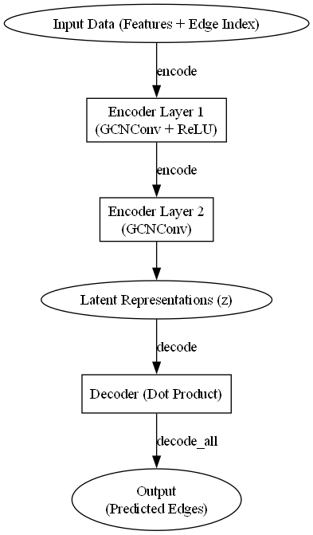
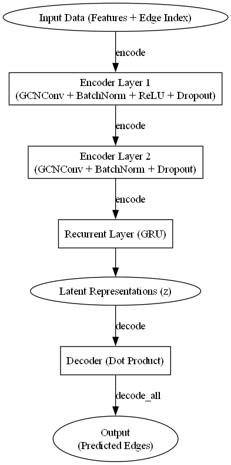
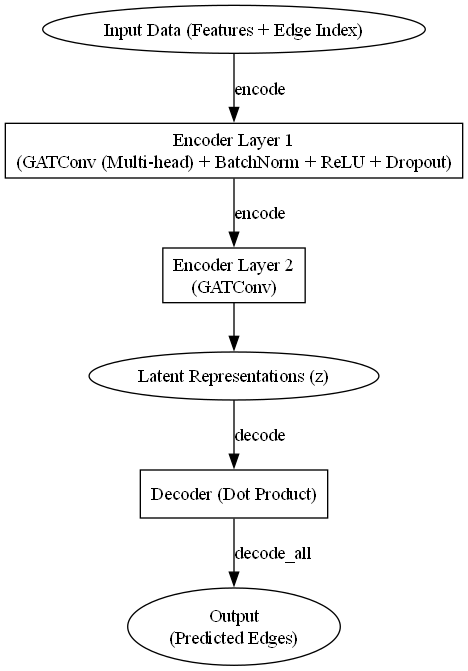
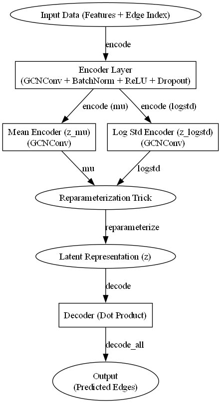

# Graph Neural Networks
The files in this folder contain the analysis done about Graph Neural Networks. The full explaination can be found in the report in the main folder, but here we show the diagrams of the tested autoencoder architectures.  
* **Standard Graph Convolutional Networks (GCN)**

* **GCN + Dropout + Batch Normalization (GCN+d+bn)**

* **GCN + Gated Recurrent Unit (GRNN)**

* **Graph Attention Network (GAT)**

* **Graph Variational Autoencoder (VAE)**

